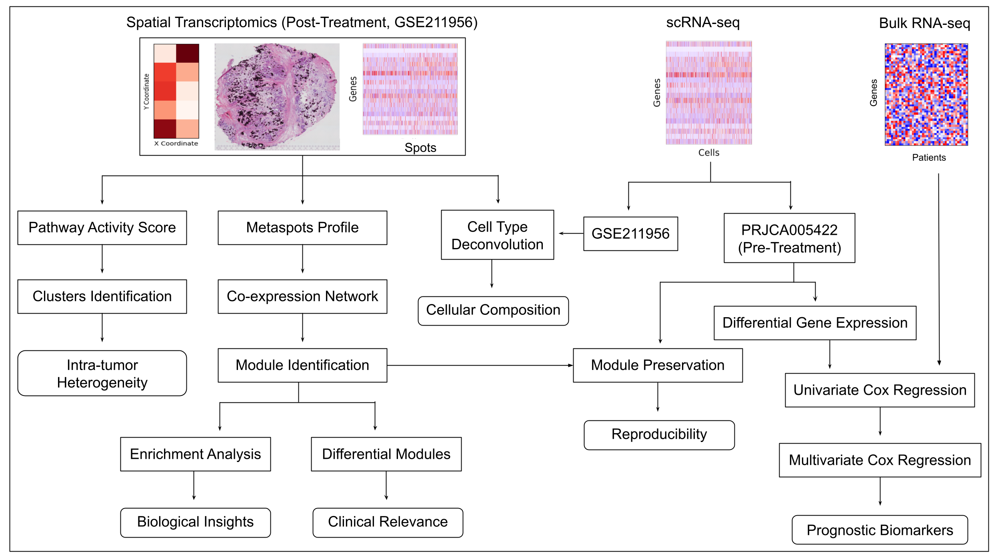

# Spatial and single-cell transcriptomics reveal pathway heterogeneity and prognostic gene signatures in high-grade serous ovarian carcinoma 

## Overview

This repository contains the computational workflows and analysis scripts used to investigate molecular and cellular features of high-grade serous ovarian cancer (HGSOC) using spatial transcriptomics, single-cell RNA sequencing (scRNA-seq), and bulk RNA sequencing data.

The analyses include spatial pathway activity profiling, intra-tumor heterogeneity analysis, cell-type deconvolution, transcriptional co-expression network analysis, module identification and preservation, differential gene expression analysis, and prognostic biomarker identification.

## Study Design and Computational Workflow



### Spatial Transcriptomics

Post-treatment spatial transcriptomics data from GSE211956 were analyzed to characterize spatially resolved molecular features of HGSOC. The analysis included:

- Cell-type deconvolution and cellular composition analysis
- Pathway activity scoring
- Pathway-based clustering
- Co-expression network construction
- Module identification
- Differential module analysis
- Functional enrichment analysis

### Single-Cell RNA Sequencing

Single-cell RNA-seq datasets were used to support cell-type annotation, module preservation analysis, and identification of transcriptional programs associated with chemotherapy reponse prior to treatment.

Datasets include:

- GSE211956
- GSE165897
- PRJCA005422

### Bulk RNA Sequencing

Bulk RNA-seq data were used for clinical and prognostic analyses, including:

- Univariate Cox regression
- Multivariate Cox regression
- Risk stratification
- Identification of prognostic biomarkers

The analyses include data from TCGA and the ICGC ovarian cancer cohort.

## Data Availability

The large processed data objects used during the analysis are not included in this repository.
Publicly available datasets used in this study include:
- GSE211956
- GSE165897
- PRJCA005422
- TCGA-OV
- ICGC OV-AU
Please refer to the respective data repositories and associated publications for data access and usage information.

## Software and Dependencies

The computational analyses were performed using R and Python.
The software environment and major package dependencies are provided in:
```text
environment.yml
```

## Reproducibility

The notebooks and scripts in this repository are organized according to the major analysis steps shown in the workflow figure.
Before running the analyses:
1. Install the required software and dependencies.
2. Download the relevant publicly available datasets.
3. Update dataset paths in the notebooks/scripts as required.
4. Run the preprocessing workflows before downstream analyses.

## Citation

If you use this code or analysis workflow, please cite:
Srivastava, Akansha, and P. K. Vinod. "Deciphering Spatially Resolved Pathway Heterogeneity in Ovarian Cancer Post-Neoadjuvant Chemotherapy." bioRxiv (2025): 2025-08.

## Repository Structure

```text
.
├── cellType_deconvolution/
│   └── Cell-type deconvolution analyses
├── data_preprocessing/
│   └── Data preprocessing and preparation workflows
├── module_identification/
│   └── Co-expression network, module identification,
│       differential module and module preservation analyses
├── pathway_clustering/
│   └── Pathway activity scoring and clustering analyses
├── preTreatment/
│   └── Pre-treatment and prognostic analyses
├── figures/
│   └── workflow.png
├── data/
│   └── Local analysis data (not included in the repository)
├── .gitignore
├── environment.yml
└── README.md

```

## Contact
For any query related to the code/work, Please reach out to us at akansha.srivastava@research.iiit.ac.in


